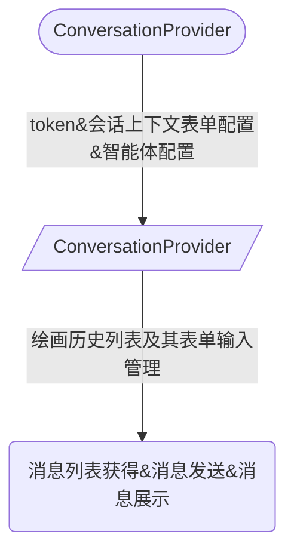

# dify 客户端工具


## 本包导出的reactProvider

### AppParamsProvider|ParamsProvider

提供应用的全局配置
1. 自动请求token
2. 表单配置
3. 应用文件信息限制
4. 自动请求passport(token|auth)
5. meta信息
6. site信息


```mermaid
graph LR


```

### ConversationProvider

在AppParamsProvider完成token获取后, 会自动发起会话相关信息

1. 会话历史
2. 上一次智能体的会话id
3. 表单功能(TODO: 未完成)

```mermaid
graph LR


```


### MessageProvider

最复杂的组件, 提供消息相关处理逻辑和信息

1. 负责监听消息发送事件,同时将获得表单schema(zod),验证表单是否完整
2. 发送消息,并监听sse流,同时解析文本并储存文本信息
3. 触发sse对应的时间类型到事件总线
4. 监听中断sse事件, 并立即中断sse流, 而不管dify消息流是否正常终止响应任务

```mermaid
graph LR


```


### Provider联系和层级

dify总体上由`AppParamsProvider`提供token, 和应用配置, 然后将token和参数提供给 `ConversationProvider`, 由`ConversationProvider`提供会话管理或切换功能, 毕竟每一个消息都是属于一轮会话的,

毕竟ai如果丢失了会话就跟丢失了上下文, 你之前说过的什么全都忘记了.

因此, 其信息传递流程如下




总体来说,以上信息流传递中可以替换任意一个提供环节. 以提供自定义的功能

## 本包导出的工具函数

包含客户端请求需要的接口

### resetService

在包内部,请求工具使用的的是 ky , 该方法允许重写 ky的请求逻辑

### getAppAccessMode

获得dify那边的访问模式

### getAppAccessToken

获得访问令牌

### getAppRuntimeParameters

获得运行时参数

### getAppSiteinfo

获得站点(应用的配置在ui上的展现)信息


### getAppMeta

meta信息,好像没什么用


### getConversationMessages

通过conversation id 获得会话的所有消息


### getConversations

获得某个应用的所有会话


### deleteConversation

删除某个会话的call

### setConversationTitle

设置或生成会话的标题


### getConversationVariables
获得会话的变量信息


### sendMessageFeedback
发送对某个消息的反馈信息


### messageFeedbacks

获得所有信息的反馈信息


### audioToText

语音转文字信息


### textToAudio

文字转语音


### uploadFile
上传文件


### previewFile

预览文件


### sendMessage

发送消息


